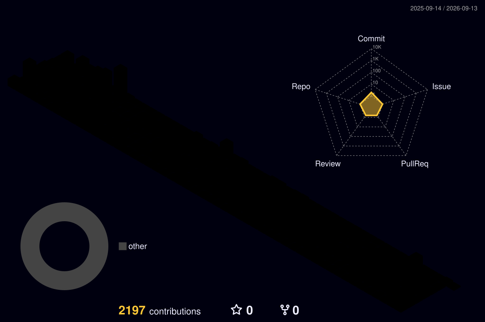

## Hi, I'm Gustavo Matheus Pauvels 👋

- 🌱 I’m currently learning JavaScript, TypeScript & AWS Technologies
- 🌱 I am currently studying TSI (Internet Systems Technology) at UTFPR (Federal Technological University of Paraná)

 

# 📊 GitHub Stats :

|  |  |
| ----------- | ----------- |
 

# 💻 I have knowledge and experience in:

  

## 🌐 Socials
    

### ✍️Random Dev Quote

 

---

